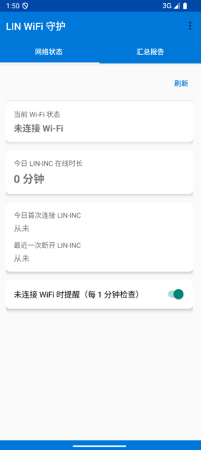
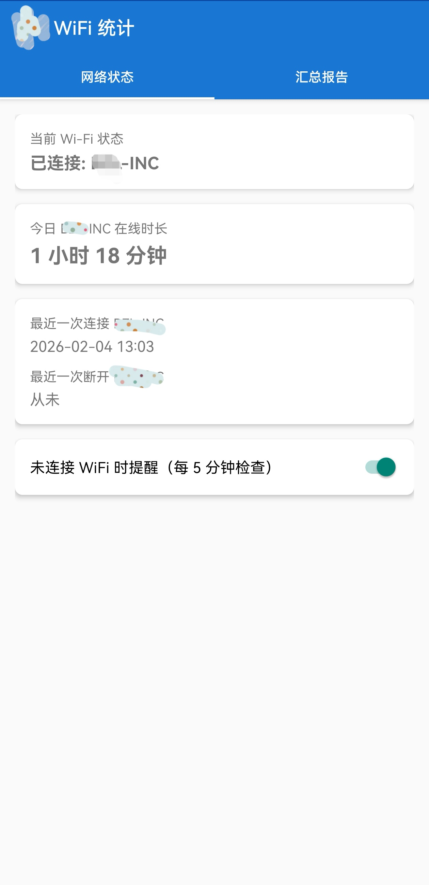
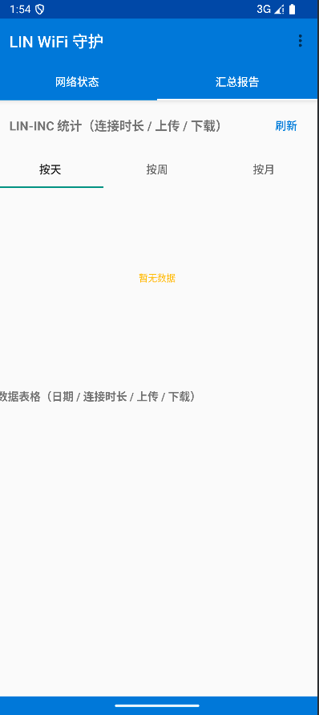
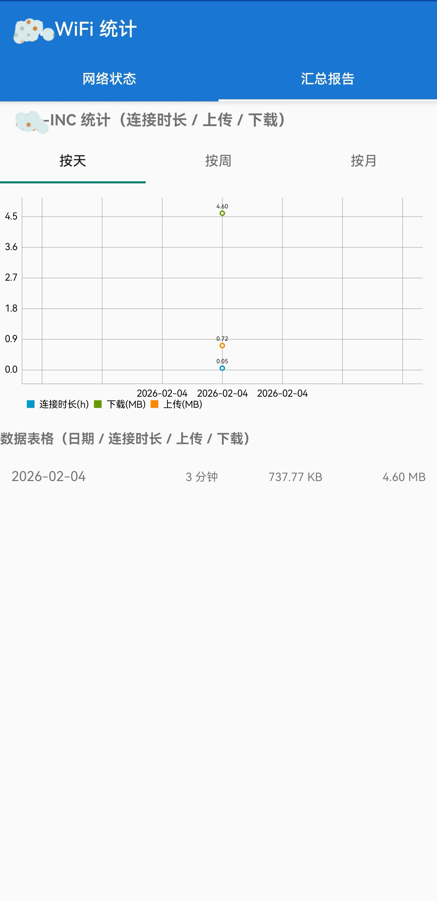
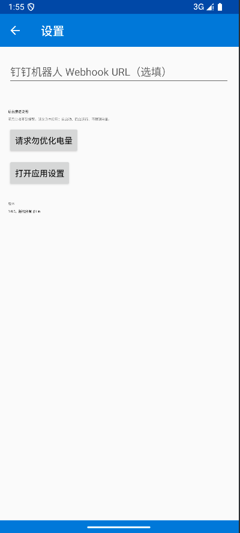
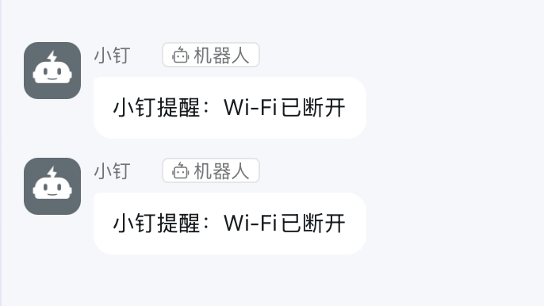

# WiFi 统计 (Android)

简单 Android 应用，实现：

1. **WiFi 连接检查**
    - 每 1 分钟检查一次是否连接 WiFi；未连接时发送通知提醒。
    - 可通过首页开关开启/关闭该检查。
    - 开机后若之前已开启，会自动恢复定时检查。
    - 支持订阅钉钉webhook推送断连通知

2. **Wi-Fi 统计**
    - 仅统计连接名为 **LIN-INC** 的 WiFi：(设置中可修改Wi-Fi名称)
        - 连接总时长
        - 上传总流量（tx）
        - 下载总流量（rx）
    - 按 **天 / 周 / 月** 三个维度展示：
        - 折线图：连接时长(h)、下载(MB)、上传(MB)
        - 表格：日期、连接时长、上传、下载
3. **手机安装注意事项**
    - 需要对应用开启消息推送和运行后台运行的权限（部分手机系统自动管理app,会存在杀后台情况）
        - 后台权限不足可能导致问题：时间计算不准确、Wi-Fi断开提示消息无法发送或者发送堆积延迟

## 环境与构建

- 需 **JDK 11 或 17**、**Android SDK**（compileSdk 34，minSdk 24）。当前配置支持在 Java 11 下构建。

### 若提示 `no such file or directory: ./gradlew` 或缺少 `gradle-wrapper.jar`

**方式一：用 Android Studio（推荐）**

1. 用 Android Studio 打开本目录（`android` 文件夹）。
2. 等待 Gradle Sync 完成（IDE 会自动下载/生成 wrapper）。
3. 菜单 **Build → Build Bundle(s) / APK(s) → Build APK(s)**，或直接 Run 到设备。

**方式二：命令行生成 wrapper 后再用 ./gradlew**

若本机已安装 [Gradle](https://gradle.org/install/)（`gradle --version` 能执行），在项目根目录执行一次：

```bash
cd android
gradle wrapper --gradle-version 8.2
```

会生成 `gradle/wrapper/gradle-wrapper.jar` 和可执行脚本。之后即可：

```bash
./gradlew assembleDebug

 ./gradlew build
```

### 安装到设备

```bash
adb install -r app/build/outputs/apk/debug/app-debug.apk
```

## 权限说明

- `ACCESS_NETWORK_STATE` / `ACCESS_WIFI_STATE`：检测 WiFi 连接与 SSID。
- `INTERNET`：应用基础网络能力。
- `FOREGROUND_SERVICE` / `POST_NOTIFICATIONS`：定时检查时发通知（Android 13+ 需通知权限）。
- `RECEIVE_BOOT_COMPLETED`：开机后恢复 1 分钟检查（若用户曾开启）。

> 部分机型在 Android 9+ 上获取当前 WiFi SSID 需要定位权限；若未授权，可能无法识别 LIN-INC，统计会不准确。

## 项目结构概要

- `app/src/main/java/com/lin/wifistats/`
    - **MainActivity**：首页，WiFi 检查开关 + 日/周/月 Tab 与统计图表、表格。
    - **WifiCheckReceiver** + **WifiCheckScheduler**：每 1 分钟执行一次检查，未连 WiFi 时发通知。
    - **WifiStatsStore**：按天持久化Wi-Fi的时长与流量，并聚合成周/月。
    - **WifiUtils**：判断是否连 WiFi、当前 SSID 是否为 配置的目标Wi-Fi。
    - **Prefs**：是否开启“未连 WiFi 提醒”的开关状态。
    - **BootReceiver**：开机后若开关为开，重新调度 1 分钟检查。

统计仅针对 SSID 为所配置的WiFi；连接其他 WiFi 或移动网络时不会计入。

## 特别声明
* 本仓库发布的`wifi-stats`项目中涉及的任何代码/APK，仅用于测试和学习研究，禁止用于商业用途，不能保证其合法性，准确性，完整性和有效性，请根据情况自行判断。
* 如果任何单位或个人认为该项目的代码/APK可能涉嫌侵犯其权利，则应及时通知并提供身份证明，所有权证明，我们将在收到认证文件后删除相关代码/APK。
* 隐私声明： `wifi-stats` 不会收集任何您的隐私数据,完全本地程序，无后端服务。
* 防诈提醒： `wifi-stats`完全免费开源。

## 预览
### 1.主页


### 2.汇总页


### 3.配置项


